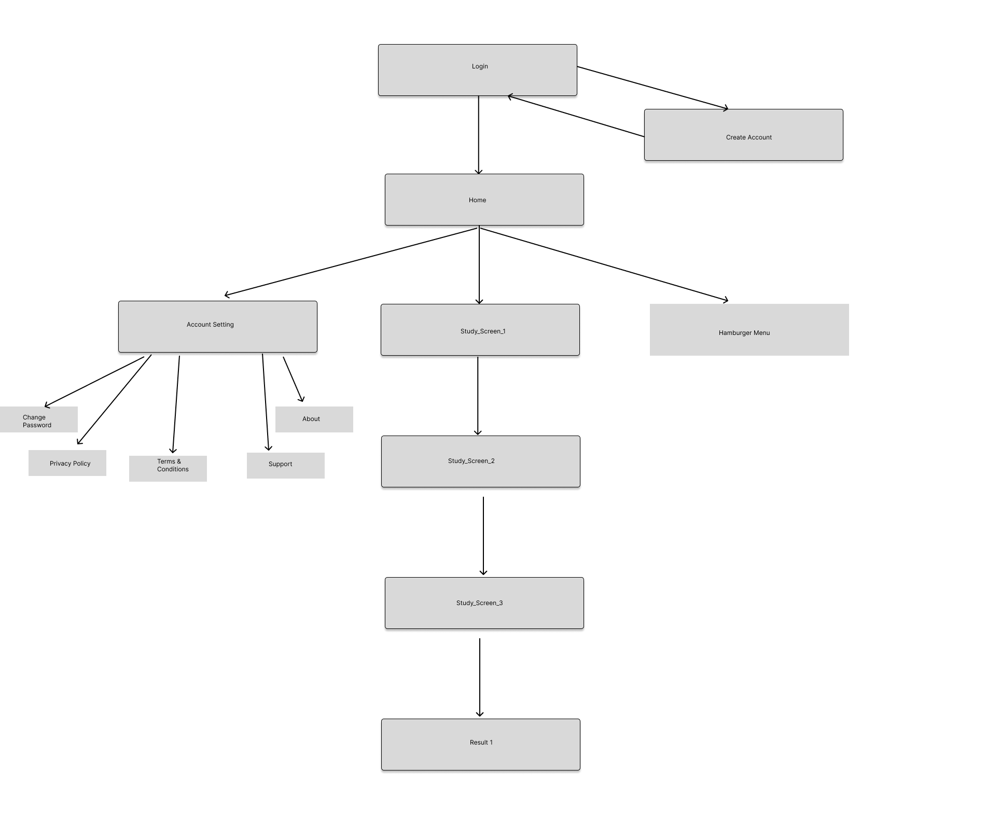
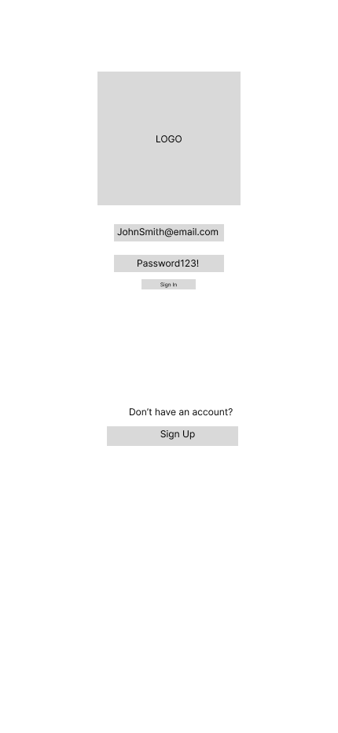
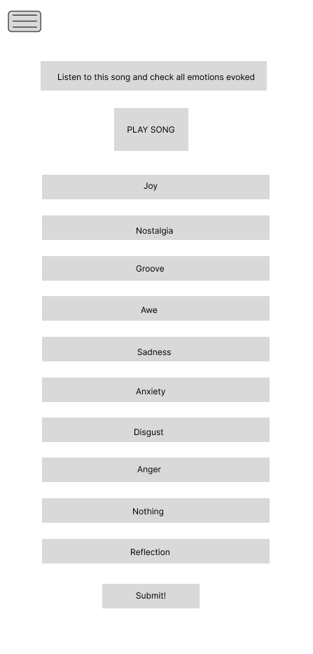
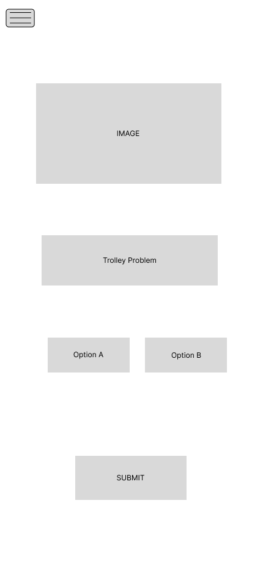
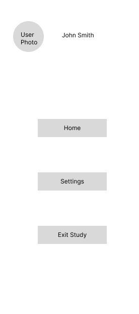
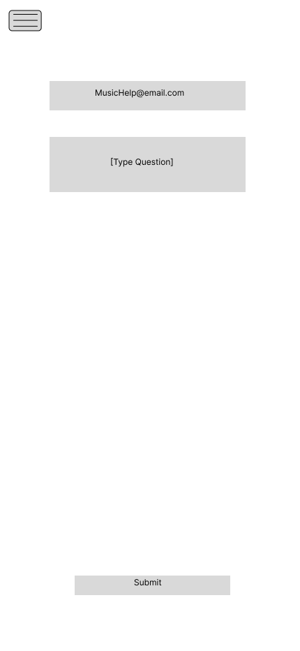

# User Experience Design

## Prototype 
https://www.figma.com/file/8RI087lwVsqi8xU2bjIC2t/Auditory-Cheesecake?type=design&node-id=0%3A1&mode=design&t=7M6peGmNLCHPDIt6-1

## App Map 

This app map displays the hierarchy of our app as a whole

## Wireframe

### Login

This is a login screen where the user lands when they are starting the app

### Create Account
If a user is new and does not have an account, they can create one here

### Home Page (Landing Page)
This is the home page, the first screen of the study. Users drag songs around to place them in an order of their liking

### Study Screen 1
In this screen, a user plays a song and rates it from 1-7 and presses submit to proceed

### Study Screen 2
In this screen, a user plays a song and checks all the emotions it evokes (can be more than one) then presses next

### Study Screen 3
This is an example of an ethical question our study will ask. The example used is the trolley problem

### Hamburger Menu
Whenever a user clicks on the top left, it opens a hamburger menu, which opens this screen on the side

### Account Settings
The settings button opens this settings page where a user can manage their password and view the app's policies

### Change Password
This is where a user goes to change password. They enter their old and new password and save it

### About Us
This page will give information about the app, its purpose, its creators, and general information the user wants

### Privacy Policy
The privacy policy will display the informed consent part of the study. Because this is a psychology + music study, it is important for user to know how their data is recorded, processed, and analyzed

### App Support
This is where the user can submit any support-related question for the back-end team

### Terms & Conditions
This is the terms and conditions page where the user can view the study's process and policies.

### Results (End of Study)
Finally, this is the end of the study. Once the user has completed the study, a page with recommended songs will appear.

